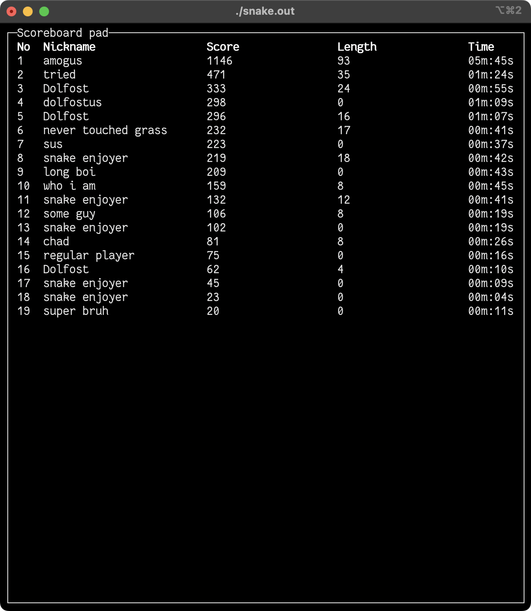

# snake-cpp

Hello and welcome to the home of the ncurses snake game written in [neovim][nvim] by one entusiast in his spare time!

### Game features
- [x] Speed
- [x] Performance
- [x] Beauty
- [x] Portabilty
- [x] Tries to be *POSIX-compliant*
- [x] "Window" system
- [x] Game itself
- [x] Scoreboard
- [x] Help window
- [x] Log windows
- [x] Terminal options

## Screenshots
 |  
:---:|:---:
 |  
 | 

## How to install
### Installing dependencies
Game relies on the [newcurses][ncurses] C library, so You have to install it on your machine.
##### Mac OS
If You use MacOS You can install [newcurses][ncurses] with [homebrew][brew] simply by
    
    $ brew install ncurses

##### Unix-like OS
Short ansver: _It depends._  
For examle, if You are using Ubuntu You can install [newcurses][ncurses] by

    $ sudo apt-get install libncurses5-dev libncursesw5-dev

If You say _I use Arch btw_ often, You can try

    $ sudo pacman -S ncurses

If You'r distro isn't mentioned here, try to use [google](google.com):

    how to install ncurses in *put your distro name here*

### Getting the sources
Enter desired directory and run 

    $ git clone https://github.com/Dolfost/snake-cpp
    $ cd snake-cpp

It will create the directory with name `snake-cpp` and enter it. Then You have to compile the game.

### Compiling the game
To build the game You can use `build.sh` script. It is located in the root of git repository. 
To run it, use:

    $ ./build.sh

It will create the game executable `snake.out` and build the help pad for current terminal.

## Running the game
To start the game You can exexute

    $ ./shanke.out

in the git directory root. 

If You are new to the game (probably You are), I recommend You to start game with the `--help` or `-h` option, so You can get used to it.

    $ ./snake.out --help

## Contributing
If You find any bugs or unexpected behaivors or just want to
contribute to the snake-cpp, You are welcome at the [issues tab][issue].

[nvim]: https://github.com/neovim/neovim "Go to nvim github page"
[ncurses]: https://en.wikipedia.org/wiki/Ncurses "Go to ncurses wikipedia page"
[brew]: https://brew.sh "Visit homebrew homepage"
[issue]: https://github.com/Dolfost/snake-cpp/issues "Go to issues tab"
